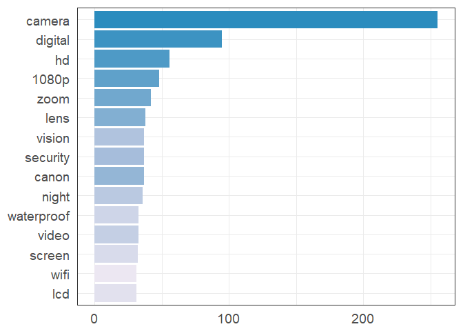
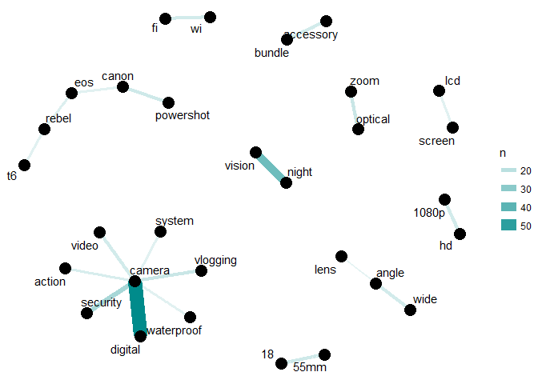

Products
================
Ritu
Jan 29, 2019

``` r
rm(list = ls()) ; gc()
```

    ##          used (Mb) gc trigger (Mb) max used (Mb)
    ## Ncells 467518 25.0     750400 40.1   592000 31.7
    ## Vcells 833801  6.4    1650153 12.6  1023642  7.9

``` r
# Import libraries
library(ggplot2)
```

    ## Warning: package 'ggplot2' was built under R version 3.4.2

``` r
library(readr)
```

    ## Warning: package 'readr' was built under R version 3.4.2

``` r
library(dplyr)
```

    ## Warning: package 'dplyr' was built under R version 3.4.4

    ## 
    ## Attaching package: 'dplyr'

    ## The following objects are masked from 'package:stats':
    ## 
    ##     filter, lag

    ## The following objects are masked from 'package:base':
    ## 
    ##     intersect, setdiff, setequal, union

``` r
library(igraph)
```

    ## Warning: package 'igraph' was built under R version 3.4.4

    ## 
    ## Attaching package: 'igraph'

    ## The following objects are masked from 'package:dplyr':
    ## 
    ##     as_data_frame, groups, union

    ## The following objects are masked from 'package:stats':
    ## 
    ##     decompose, spectrum

    ## The following object is masked from 'package:base':
    ## 
    ##     union

``` r
library(ggraph)
```

    ## Warning: package 'ggraph' was built under R version 3.4.4

``` r
library(tidytext)
```

    ## Warning: package 'tidytext' was built under R version 3.4.4

``` r
library(stringr)
```

    ## Warning: package 'stringr' was built under R version 3.4.2

``` r
library(tidyr)
```

    ## Warning: package 'tidyr' was built under R version 3.4.4

    ## 
    ## Attaching package: 'tidyr'

    ## The following object is masked from 'package:igraph':
    ## 
    ##     crossing

``` r
library(ggthemes)
```

    ## Warning: package 'ggthemes' was built under R version 3.4.2

``` r
library(RColorBrewer)
```

``` r
# Read data
#setwd("C:\\Users\\Ritu\\Documents\\Learning\\Self\\CS\\code\\Selenium")
data <- read_csv("products.csv")
```

    ## Parsed with column specification:
    ## cols(
    ##   Products = col_character()
    ## )

``` r
# View data
dim(data)
```

    ## [1] 144   1

``` r
names(data)
```

    ## [1] "Products"

``` r
View(data)
```

``` r
# converting to tidy text
tidy_new <- data %>% unnest_tokens(word_new, Products) %>% filter(!word_new %in% stop_words$word,
         str_detect(word_new, "[a-z]"))
```

    ## Warning: package 'bindrcpp' was built under R version 3.4.4

``` r
# Top words
c <- tidy_new %>% count(word_new, sort=TRUE) %>% filter(n > 30) %>% mutate(word = reorder(word_new, n))

c
```

    ## # A tibble: 15 x 3
    ##    word_new       n word      
    ##    <chr>      <int> <fct>     
    ##  1 camera       255 camera    
    ##  2 digital       95 digital   
    ##  3 hd            56 hd        
    ##  4 1080p         48 1080p     
    ##  5 zoom          42 zoom      
    ##  6 lens          38 lens      
    ##  7 canon         37 canon     
    ##  8 security      37 security  
    ##  9 vision        37 vision    
    ## 10 night         36 night     
    ## 11 video         33 video     
    ## 12 waterproof    33 waterproof
    ## 13 screen        32 screen    
    ## 14 lcd           31 lcd       
    ## 15 wifi          31 wifi

``` r
colourCount = nrow(c)
getPalette = colorRampPalette(brewer.pal(3, "PuBu"))

tidy_new %>%
  count(word_new, sort = TRUE) %>%
  filter(n > 30) %>%
  mutate(word = reorder(word_new, n)) %>%
  ggplot(aes(word, n, fill=getPalette(colourCount))) +
  geom_col() +
  xlab(NULL) +
  ylab(NULL) +
  theme_bw(base_size = 18)  +
  scale_fill_manual(values=getPalette(colourCount)) +
  theme(axis.ticks = element_blank()) + 
  theme(legend.position="none") + 
  coord_flip()
```



``` r
# N-grams Analysis
bigrams_new <- data %>% unnest_tokens(bigram, Products, token = "ngrams", n = 2) 

bigrams_new %>% 
  count(bigram, sort = TRUE)
```

    ## # A tibble: 1,791 x 2
    ##    bigram               n
    ##    <chr>            <int>
    ##  1 digital camera      59
    ##  2 camera with         43
    ##  3 night vision        36
    ##  4 security camera     24
    ##  5 full hd             17
    ##  6 optical zoom        17
    ##  7 vlogging camera     17
    ##  8 18 55mm             16
    ##  9 canon powershot     16
    ## 10 accessory bundle    15
    ## # ... with 1,781 more rows

``` r
# Filter stopwords
bigrams_separated <- bigrams_new %>%
  separate(bigram, c("word1", "word2"), sep = " ")

bigrams_filtered <- bigrams_separated %>%
  filter(!word1 %in% stop_words$word) %>%
  filter(!word2 %in% stop_words$word)

# new bigram counts:
bigram_counts <- bigrams_filtered %>% 
  count(word1, word2, sort = TRUE)

bigram_counts
```

    ## # A tibble: 1,447 x 3
    ##    word1     word2         n
    ##    <chr>     <chr>     <int>
    ##  1 digital   camera       59
    ##  2 night     vision       36
    ##  3 security  camera       24
    ##  4 optical   zoom         17
    ##  5 vlogging  camera       17
    ##  6 18        55mm         16
    ##  7 canon     powershot    16
    ##  8 accessory bundle       15
    ##  9 hd        1080p        15
    ## 10 video     camera       15
    ## # ... with 1,437 more rows

``` r
set.seed(1234)

bigram_counts %>%
  filter(n > 10) %>%
  graph_from_data_frame() %>%
  ggraph(layout = "fr") +
  geom_edge_link(aes(edge_alpha = n, edge_width = n), edge_colour = "cyan4") +
  geom_node_point(size = 5) +
  geom_node_text(aes(label = name), repel = TRUE, 
                 point.padding = unit(0.2, "lines")) +
  theme_void()
```


